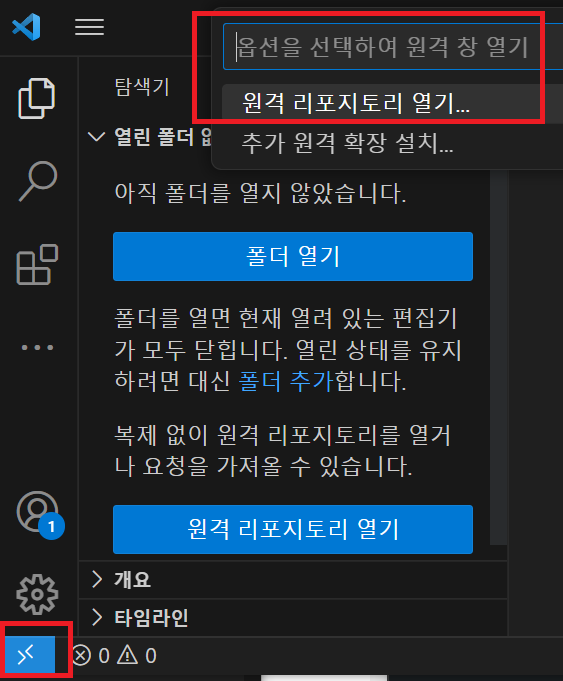
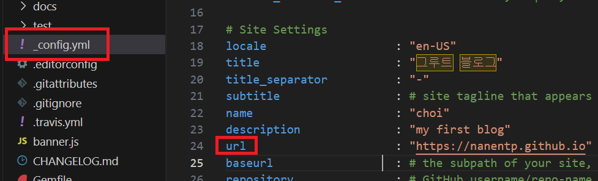

# 깃헙 페이지 블로그 만들기

## 들어가며

깃헙 페이지(Github Pages)를 이용하면 무료로 인터넷에 게시 가능한 자신의 블로그를 만들 수 있습니다. 블로그 글들은 마크다운 (`markdown`)으로 작성 가능합니다. 본인의 블로그를 만들고, 깃헙 리포를 관리하며, 마크다운으로 자신의 공부/연구를 인터넷에 공유하는 것은 굉장히 좋은 경험이자 포트폴리오가 됩니다.

유투브 영상을 보시거나 스크롤을 내려 이 페이지를 보며 따라하시면 약 10분안에 블로그를 만들 수 있습니다.&#x20;



### 1. 깃헙 계정 만들기

깃헙 계정을 생성합니다([링크](https://github.com/signup)). 계정 만들기를 못하시겠다면 구글에 "깃헙/깃허브/Github 계정 만드는 법" 등을 검색하셔서 계정을 만듭니다.

### 2. 블로그 테마 fork 하기

이번 실습에서는 [Minimal-Mistakes](https://github.com/mmistakes/minimal-mistakes) 테마를 이용합니다. 해당 깃헙 리포에 가서 Fork -> Create a new fork 를 클릭합니다.

<figure><figcaption></figcaption></figure>

Repository 이름은 꼭 `<본인 깃헙 아이디>.github.io`로 지정합니다. 예를 들어 이 실습에서는 github 유저 아이디가 `nanentp` 이기 때문에, `nanentp.github.io` 로 지정했습니다.

<figure><figcaption></figcaption></figure>

### **1. VSCode 다운로드**&#x20;

[https://code.visualstudio.com/download](https://code.visualstudio.com/download) 로 가서 본인의 운영체제에 맞는 인스톨러를 다운로드 받습니다. 대부분은 그냥 Windows 8,10,11 이라고 적혀있는 큰 버튼을 누르시면 됩니다.

<figure><figcaption></figcaption></figure>

인스톨러를 실행한 뒤 아무것도 바꾸지 않고 next, next, install을 눌러 설치합니다.

### 2. 익스텐션 설치&#x20;

VSCode 설치가 끝나면 실행한 뒤, 왼쪽의 Extensions 탭으로 가 `github repositories` 를 검색 한 뒤, 설치합니다.

<figure><figcaption></figcaption></figure>

익스텐션 설치가 끝나면 VSCode의 왼쪽하단에 있는 `><` 버튼 -> 원격 리포지토리 열기 -> 'Github' 에서 리포지토리 열기를 누릅니다. 그 뒤, 깃헙으로 로그인합니다.

<figure><figcaption></figcaption></figure>

<figure><figcaption></figcaption></figure>

### 3. 깃헙 페이지 리포 수정&#x20;

로그인이 끝나면 다시 한 번 왼쪽 하단의 `><` 버튼 -> 원격 리포지토리 열기 -> 'Github' 에서 리포지토리 열기 -> 본인 깃헙계정.github.io 리포를 누릅니다. 그러면 VSCode에 깃헙 페이지 리포가 나옵니다.

리포의 `_config.yml` 파일의 URL은 `https://<본인깃헙계정>.github.io` 계정으로 지정해줍니다. 그 뒤, title, name, description, Author name, bio, location 등을 업데이트 해줍니다. 한글도 됩니다.

<figure><figcaption></figcaption></figure>

실제 블로그 글은 `_posts` 디렉토리를 만든 뒤, `YYYY-MM-DD-블로그-제목-아무거나.md` 파일을 만든 뒤 Markdown 형식으로 블로그를 쓰시면 됩니다. 마크다운에 익숙하지 않으신 분들은 다음의 마크다운 [레퍼런스](https://docs.github.com/ko/get-started/writing-on-github/getting-started-with-writing-and-formatting-on-github/basic-writing-and-formatting-syntax)를 확인해주시기 바랍니다.

이미지는 assets 폴더에다가 본인이 가지고 있는 이미지 파일을 드래그/드롭을 해준 뒤, `` 처럼 사용하면 됩니다.

<figure><figcaption></figcaption></figure>

블로그 쓰기가 끝나면 왼쪽 3번째 버튼인 "소스 제어"로 들어가 커밋 메시지를 작성한 뒤, 커밋 및 푸시를 눌러줍니다.

<figure><figcaption></figcaption></figure>

그 뒤, 약 2분 정도 기다린 후 `https://본인깃헙계정.github.io` 방문하면 블로그가 나옵니다.

<figure><figcaption></figcaption></figure>

