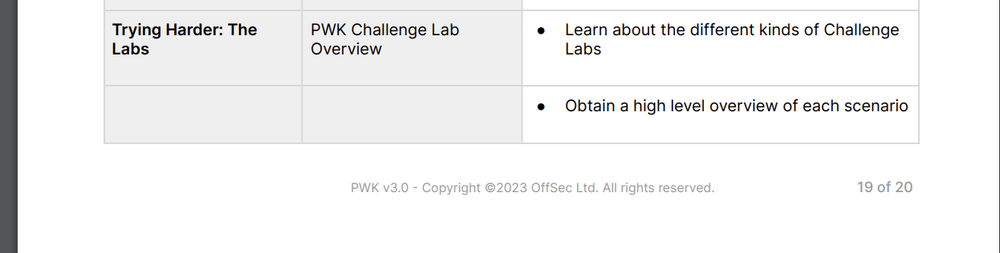

# 깃헙 페이지 블로그 만들기

## 들어가며

깃헙 페이지(Github Pages)를 이용하면 무료로 인터넷에 게시 가능한 자신의 블로그를 만들 수 있습니다. 블로그 글들은 마크다운 (`markdown`)으로 작성 가능합니다. 본인의 브롤그를 만들고, 깃헙 리포를 관리하며, 마크다운으로 자신의 공부/연구를 인터넷에 공유하는 것은 굉장히 좋은 경험이자 포트폴리오가 됩니다.

### 1. 깃헙 계정 만들기

깃헙 계정을 생성합니다([링크](https://github.com/signup)). 계정 만들기를 못하시겠다면 구글에 "깃헙/깃허브/Github 계정 만드는 법" 등을 검색하셔서 계정을 만듭니다.

### 2. 블로그 테마 fork 하기

이번 실습에서는 [Minimal-Mistakes](https://github.com/mmistakes/minimal-mistakes) 테마를 이용합니다. 해당 깃헙 리포에 가서 Fork -> Create a new fork 를 클릭합니다.

<figure><figcaption></figcaption></figure>

Repository 이름은 꼭 `<본인 깃헙 아이디>.github.io`로 지정합니다. 예를 들어 이 실습에서는 github 유저 아이디가 `nanentp` 이기 때문에, `nanentp.github.io` 로 지정했습니다.

<figure><figcaption></figcaption></figure>

1. **VSCode 다운로드**&#x20;

[https://code.visualstudio.com/download](https://code.visualstudio.com/download) 로 가서 본인의 운영체제에 맞는 인스톨러를 다운로드 받습니다. 대부분은 그냥 Windows 8,10,11 이라고 적혀있는 큰 버튼을 누르시면 됩니다.

<figure><figcaption></figcaption></figure>

인스톨러를 실행한 뒤 아무것도 바꾸지 않고 next, next, install을 눌러 설치합니다.

VSCode 설치가 끝나면 실행한 뒤, 왼쪽의 Extensions 탭으로 가 `github repositories` 를 검색 한 뒤, 설치합니다.

<figure><figcaption></figcaption></figure>

<figure><figcaption></figcaption></figure>
